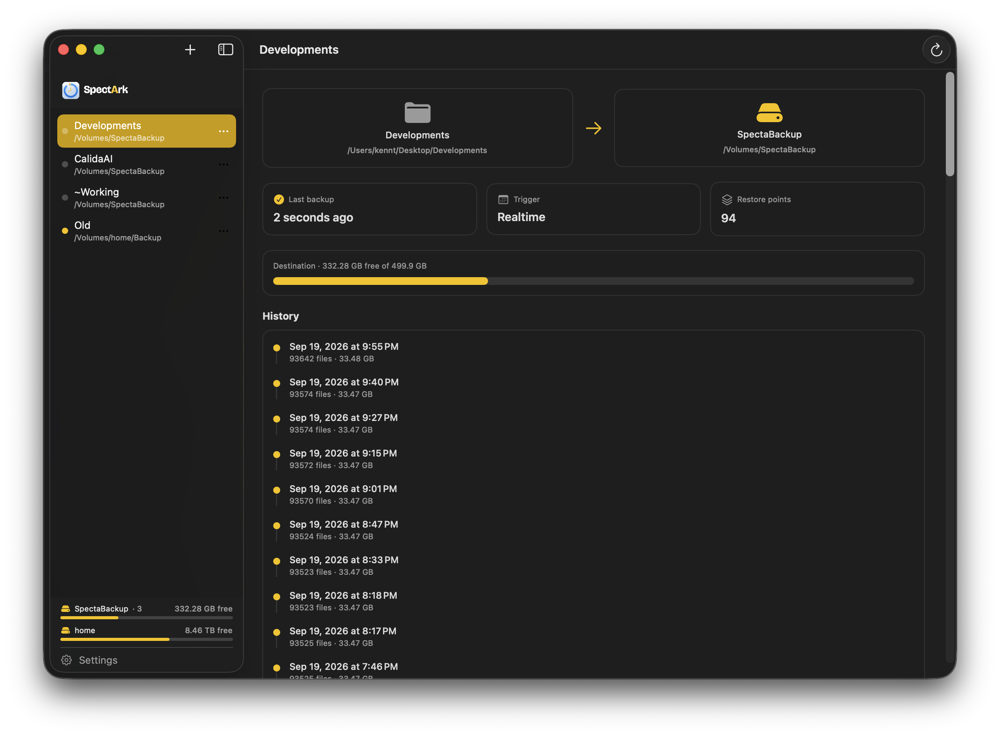

# SpectArk

[English](README.md) · **한국어** · [日本語](README.ja.md)

[](https://github.com/kennss/SpectArk/releases/latest)
[](https://github.com/kennss/SpectArk/releases)
[](LICENSE)




정말 소중한 폴더만 골라, 바뀌는 즉시 버전별로 백업하는 macOS 네이티브 앱입니다
(Calida Lab / Specta 제품군).

## 다운로드

**[⬇ 최신 DMG 받기](https://github.com/kennss/SpectArk/releases/latest)** — DMG를 열어
**SpectArk**를 응용 프로그램 폴더로 끌어다 놓으면 됩니다. Developer ID로 서명하고 Apple
공증을 받았습니다. Apple Silicon과 Intel을 모두 지원하는 유니버설 앱이며, macOS 14 이상에서
동작합니다. 설치한 뒤에는 앱이 스스로 업데이트합니다(**Check for Updates…**).

릴리즈 노트와 이전 버전은 [Releases 페이지](https://github.com/kennss/SpectArk/releases)에서
볼 수 있습니다.

## 왜 SpectArk인가

Time Machine처럼 시점별로 되돌릴 수 있는 방식은 정말 좋아합니다. 하지만 개발자로서 쓰기에는
맞지 않는 부분이 있었습니다.

- **시스템 전체 백업은 필요 없습니다.** Time Machine은 OS와 앱, 라이브러리까지 복사합니다.
  맥이 망가지면 그런 것은 다시 설치하면 됩니다. 다시 설치할 수 없는 것은 따로 있습니다.
  지금 작업 중인 소스 코드와 프로젝트입니다. 다른 분야에서 일하는 분들도 마찬가지입니다.
  편집 중인 영상, 보정 중인 사진, 작업 중인 엑셀 파일이나 문서처럼, 다시 만들 수 없는 것은
  결국 지금 손대고 있는 작업물입니다.
- **예약 백업에는 늘 빈틈이 있습니다.** 간격이 길면 최신 코드를 잃을 수 있고, 짧아도
  머피의 법칙이 찾아오는 순간 마지막 몇 분은 사라집니다. Git도 커밋한 것만 지켜 줄 뿐,
  커밋과 커밋 *사이*의 작업은 지켜 주지 못합니다.
- **그래서 코드가 바뀌는 대로 따라가는 백업이 필요했습니다.** 작업 중인 폴더를 지정하면
  모든 변경이 몇 초 안에 백업되고, 되돌아갈 복원 지점이 최대 15분마다 남습니다. 예약도,
  빈틈도 없습니다. 이 앱이 존재하는 이유가 바로 이 실시간 동작입니다.
- **드라이브 하나를 통째로 내주고 싶지도 않았습니다.** 백업 전용 디스크를 따로 두는 것은
  낭비로 느껴졌습니다. 백업을 어디에 둘지 직접 고르고, 어떤 폴더든 원하는 목적지와 자유롭게
  짝지을 수 있어야 했습니다.
- **백업이 유출 경로가 되어서는 안 됩니다.** 백업 드라이브나 NAS는 잃어버리거나 도난당할
  수 있고, 평문 백업은 그 안의 파일을 전부 넘겨주는 셈입니다. 그래서 어떤 백업이든 종단 간
  암호화를 켤 수 있습니다. 비밀번호로만 열리며, 비상용으로 한 번만 보여 주는 복구 키가
  있습니다. 암호화는 선택 사항이고 기본은 꺼져 있습니다. 필요 없을 때는 백업이 Finder에서
  바로 열리는 평범한 파일로 남습니다.

그렇게 만든 것이 SpectArk입니다. 실시간으로, 폴더 단위로, 버전별로 백업하고 원하면
암호화까지 합니다. 정말 중요한 파일을 지키고, 어디에 둘지는 사용자가 정합니다.

## 기능

- **끊김 없는 보호와 Time Machine 방식의 복원 지점**: 모든 변경이 몇 초 안에 백업되고,
  복원 지점은 최대 15분마다 남습니다. 최근 24시간은 전부, 한 달까지는 하루에 하나, 그
  이후로는 한 주에 하나씩 보관합니다. 바뀐 파일만 복사하며, 어느 폴더가 바뀌었는지는 macOS
  파일 시스템 저널에서 알아냅니다. SpectArk가 꺼져 있던 동안의 변경도 포함됩니다.
- **백업마다 실시간 또는 예약**: 폴더를 실시간으로 지켜보거나, 정해진 간격으로 실행합니다.
- **여러 원본 폴더**를 각각 원하는 목적지와 짝지을 수 있습니다.
- **로컬 디스크 또는 NAS**를 목적지로 쓸 수 있습니다. NAS 백업은 공유 폴더 안의 디스크
  이미지에 저장되며, 타임라인과 복원을 앱에서 그대로 사용할 수 있습니다. 목적지는 macOS가
  어디에 마운트하든 자동으로 찾아갑니다.
- **백업 디스크의 여유 공간을 지킵니다**: 모든 백업 디스크의 5%(또는 직접 정한 만큼)를
  비워 두고, 부족해지면 그 디스크의 모든 백업을 통틀어 가장 오래된 복원 지점부터
  삭제합니다.
- **선택적 암호화**: 내용 기반 청킹과 중복 제거, AES-256-GCM, argon2id로 만든 키, 한 번만
  보여 주는 복구 키를 사용합니다. 기본은 꺼져 있습니다(백업이 평문 그대로 탐색 가능).
- **다시 만들 수 있는 파일은 건너뜁니다**(의존성 폴더, 빌드 결과물, 캐시). 그 폴더를 만든
  도구를 확실히 알아볼 때만 건너뜁니다.
- **대시보드 창과 메뉴 막대 드롭다운**(실시간 전송 속도, 여유 공간, 마지막 백업)을
  제공하며, 로그인 시 조용히 실행됩니다.
- 샌드박스를 사용하지 않는 Developer ID 배포, macOS 14 이상.

## 시작하기

1. **+** 버튼으로 **백업을 추가합니다.** 지킬 폴더와 목적지를 고릅니다. 목적지는 어느
   디스크의 폴더든, Finder에 마운트한 NAS 공유 폴더든 상관없습니다. **Realtime**(파일이
   바뀔 때마다 백업) 또는 **Scheduled**(정해진 간격마다)를 고르고, 원하면 암호화를 켭니다.
   비밀번호를 정하고, 한 번만 보여 주는 복구 키를 반드시 저장해 두십시오.
2. **권한을 요청하면 허용합니다.** SpectArk가 데스크탑, 도큐멘트, 다운로드 폴더를 처음 읽을
   때 macOS가 권한을 묻습니다. 그 밖의 보호된 위치(다른 사용자의 폴더, 사진 보관함 등)를
   백업하려면 **시스템 설정 ▸ 개인정보 보호 및 보안 ▸ 전체 디스크 접근 권한**에서 SpectArk를
   켠 뒤, SpectArk를 종료했다가 다시 실행합니다.
3. **로그인 시 열기**를 켭니다(**Settings ▸ General**, 또는 실시간 백업 화면의 안내에서).
   실시간 백업은 SpectArk가 열려 있을 때만 동작합니다. 로그인할 때는 창도 Dock 아이콘도 없이
   메뉴 막대에서 조용히 시작합니다.
4. **기록을 얼마나 남길지** 각 백업의 **⋯ ▸ Settings**에서 정합니다. Automatic(Time Machine
   방식), 최신 N개만, N일 치만, 전부 보관 중에서 고를 수 있습니다. 최대 크기와, 백업 디스크에
   비워 둘 여유 공간(0 = 자동, 디스크의 5%)도 정할 수 있습니다.

## 복원하기

- **⋯ ▸ Restore…**(또는 백업을 우클릭): 복원 지점을 고르고, 되돌릴 파일과 폴더를 선택한 뒤,
  원래 위치나 다른 폴더로 복원합니다. 같은 이름의 파일이 이미 있을 때 어떻게 처리할지도
  고를 수 있습니다. 암호화된 백업은 복원 지점 하나를 통째로, 원하는 폴더에 복원합니다.
- **최신 백업 상태는 평범한 폴더입니다.** 로컬 디스크에 있는 백업이라면 목적지 카드를
  클릭해 Finder에서 열고, 파일을 바로 꺼내 쓸 수 있습니다.

## 빌드

Xcode 프로젝트는 [XcodeGen](https://github.com/yonaskolb/XcodeGen)으로 생성합니다.

```sh
brew install xcodegen      # 최초 한 번
xcodegen generate          # SpectaBackup.xcodeproj 생성
open SpectaBackup.xcodeproj
```

명령줄에서 바로 빌드할 수도 있습니다.

```sh
xcodegen generate
xcodebuild -project SpectaBackup.xcodeproj -scheme SpectaBackup -configuration Release build
```

`SpectaBackup.xcodeproj`는 생성되는 파일이므로 git에서 제외되며, `project.yml`이 기준입니다.
프로젝트와 스킴은 예전 이름인 `SpectaBackup`(번들 ID `ai.calidalab.spectabackup`)을 그대로
사용합니다. 이름을 바꿔도 기존 백업, 키체인 항목, 전체 디스크 접근 권한이 그대로 이어지도록
하기 위해서입니다. 빌드된 앱 이름은 `SpectArk.app`입니다. 릴리즈(서명, 공증, DMG, Sparkle
appcast)는 `scripts/release.sh`로 만듭니다.

## 데이터 무결성

백업 엔진은 정확성을 기준으로 고른 macOS 기본 기능 위에 만들어졌습니다.
- 모든 변경은 디스크를 건드리기 전에 SQLite 카탈로그에 먼저 기록됩니다. 따라서 중간에 끊긴
  백업은 다음 백업에서 복구됩니다.
- 복사본은 `fsync`한 뒤 원자적 `rename`으로 제자리에 놓으며, 카탈로그는 `F_FULLFSYNC`로
  커밋합니다.
- 복사한 파일은 모두 원본과 대조하고, 읽는 동안 원본이 바뀌었다면 그 복사본은 버립니다.
  그래서 반쯤 쓰인 파일이 기록되는 일은 없습니다.

다만 서로 일치해야 하는 파일들(데이터베이스와 그 `-wal` 파일 등)은 한 순간에 함께가 아니라
하나씩 차례로 복사됩니다. 소스 스냅샷을 사용하려면 root 권한과 Apple이 별도로 부여하는
entitlement가 필요합니다([TODO.md](TODO.md) 참고). 백업 엔진의 설계는
[`docs/INCREMENTAL_ENGINE_DESIGN.md`](docs/INCREMENTAL_ENGINE_DESIGN.md)에, 암호화 저장소의
설계는 [`docs/ENCRYPTION_DESIGN.md`](docs/ENCRYPTION_DESIGN.md)에 정리되어 있습니다.

## 로드맵

앞으로의 작업은 우선순위 순으로 [TODO.md](TODO.md)에, 지난 릴리즈는
[CHANGELOG.md](CHANGELOG.md)에 정리되어 있습니다. 기여는 언제든 환영합니다.

## 라이선스

MIT © 2026 Kennt Kim (Calida Lab) — [LICENSE](LICENSE)를 참고하십시오.
